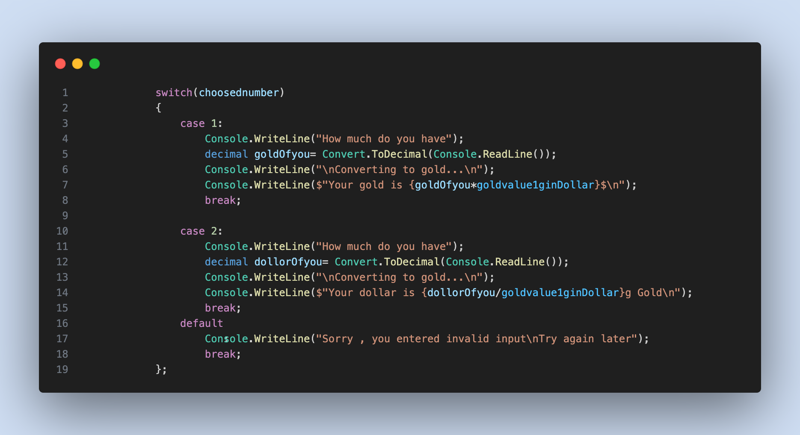
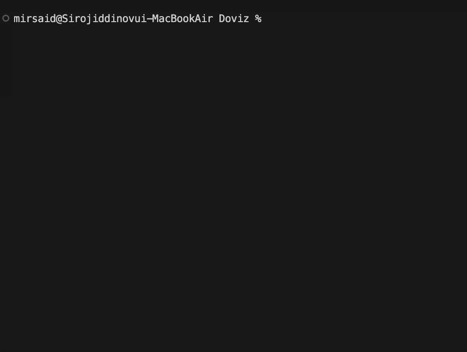

## Doviz

 This project helps to change easily **USD to Gold** && **Gold to USD** 

 ## Overview

 In this project what I used :

 *  Console input/output
 * Do While Loop
 *  `Switch` statement ->

 

## Result:
 Gold to Dollar -> 

 

 Dollar to Gold ->
 
 

 ## Non-stop result:

 

 ## Releases Note

 V1.0

 This [version/1.0]() can calculate basic part of exchanging , and also it was only one time calculation , so I uptaded it to non stop application , let's check...

 v2.0

 This [versionv/2.0]() is final project to calculate the exchanging Gold or Dollar and also this framework works without stopping , you can use whenever you want

